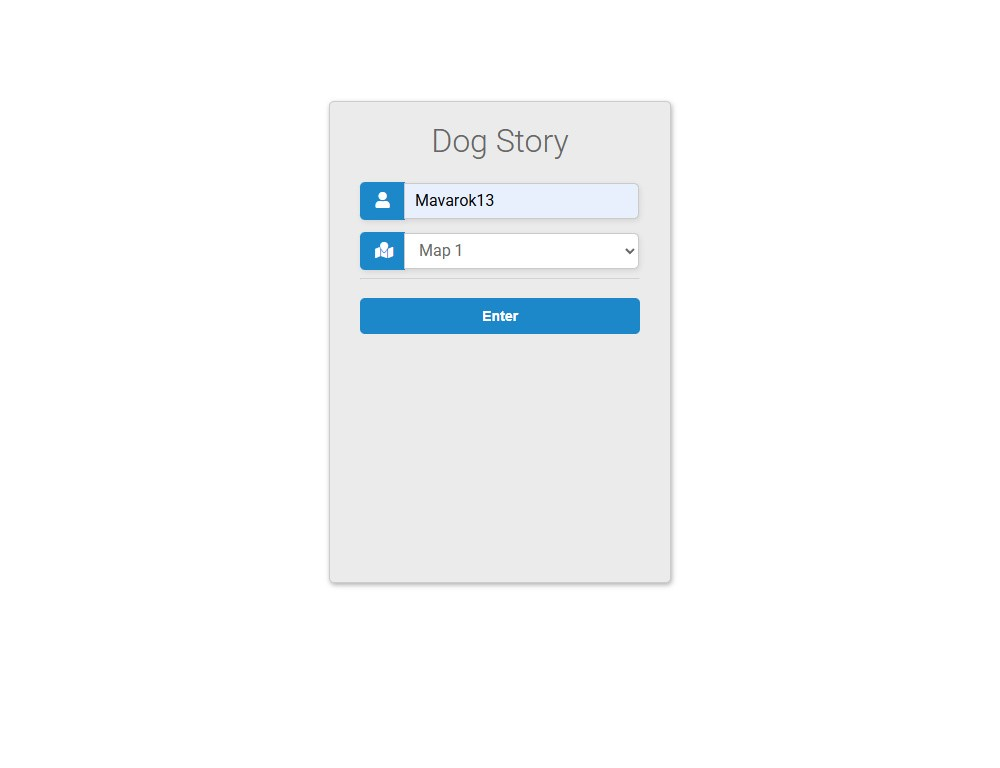
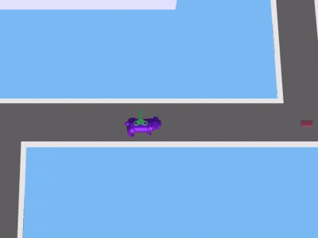
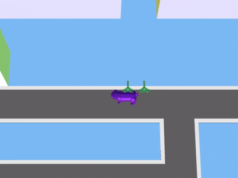
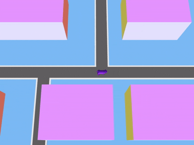

# Browser Multiplayer Game Server


A C++ backend server for a browser-based multiplayer game.

The project implements REST API communication, player session handling,
persistent game state storage, PostgreSQL integration, and Dockerized deployment.

Players explore the map, collect items, and deliver them to the base while the server manages synchronization, persistence, and gameplay logic.

## Project Overview

The game concept is simple and approachable:

- The player controls a dog in the browser
- The dog moves around a game map
- Items appear on the map and can be collected
- Collected items are brought back to the base
- Game progress and server state are persisted

The server is containerized with Docker, making it easy to run locally or demonstrate without manual dependency setup.

## Backend Architecture And Features

The backend is organized around a small set of server-side systems:

- HTTP server and routing layer for REST API endpoints
- game domain model for maps, roads, offices, dogs, loot, and sessions
- player/session manager with token-based authorization
- tick-based game loop for movement, item spawning, collision detection, and scoring
- JSON serialization layer for API responses and saved game state
- PostgreSQL persistence for retired player results and leaderboard data
- save-state support for restoring active server state between restarts
- Dockerized runtime with a separate PostgreSQL service and persistent volumes

Main backend capabilities:

- player join flow with generated authorization tokens
- map list and map detail endpoints
- real-time game state endpoint for browser synchronization
- player action endpoint for movement commands
- collision-based loot pickup and delivery scoring
- leaderboard endpoint backed by PostgreSQL
- configurable tick period, static file root, and state file path

## My role

I developed backend part of the game with C++:
- REST API
- game logic
- authorization
- HTTP request handling
- PostgreSQL integration
- multithreading
- server architecture

> Frontend/UI implementation was provided externally.
> My contribution focused entirely on backend architecture and server-side systems.

## Client screenshots
> UI presents backend working.

<details>
<summary>Menu</summary>



</details>
<details>
<summary>Gameplay</summary>




</details>
<details>
<summary>Leaving and leader bord</summary>



</details>

## Tech Stack

- C++ game server
- PostgreSQL database
- Docker and Docker Compose for local deployment
- Persistent Docker volumes for database data and saved game state

## What The Docker Setup Includes

The project starts two services:

- `game-server`: runs the game backend and exposes it on port `8080`
- `postgres`: stores game data in PostgreSQL

Docker volumes are used to keep database data and saved game state between restarts.

## How To Start

Make sure Docker Desktop is running.

From the project root, run:

```sh
docker compose up --build
```

After the containers start, open:

```text
http://localhost:8080
```

## How To Stop

Stop the running containers:

```sh
docker compose down
```

To stop the project and remove saved Docker volumes, including database data and saved game state, run:

```sh
docker compose down -v
```

## Docker Troubleshooting

If Docker returns an error such as `Bad Gateway`, `EOF`, or `cannot find //./pipe/docker_engine`, Docker Desktop may not be running correctly or the wrong Docker context may be selected.

Start or restart Docker Desktop, wait until it reports that Docker is running, then run:

```sh
docker context use desktop-linux
docker info
docker compose up --build
```

If Docker API environment variables were previously set in the shell, unset them before retrying:

```sh
unset DOCKER_HOST DOCKER_API_VERSION
```
